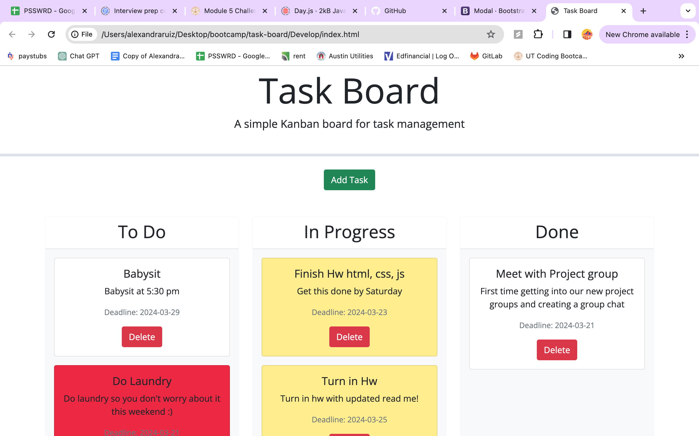

# My task-board

As someone who is balancing a new job, class, homework, studying, and just the normal daily tasks that need to get done my paper and pen planner just isn't cutting it anymore so i have developed a task board application with started code.

This task board helps me manage my projects and here is how it works.
When I open the task board.
The the list of project tasks is displayed in columns representing the task progress state (Not Yet Started, In Progress, Completed)
Then when I view the task board for the project each task is color coded to indicate whether it is nearing the deadline (yellow) or is overdue (red).
Then I click on the button to define a new task and I can enter the title, description and deadline date for the new task into a modal dialog and I click the save button for that task.
The properties for that task are saved in localStorage
So when I drag a task to a different progress column the task's progress state is updated accordingly and will stay in the new column after refreshing.
I click the delete button for a task then the task is removed from the task board and will not be added back after refreshing.
I refresh the page and the saved tasks persist.

# Application:

# Link to application:

<!-- <https://rualexandra.github.io//> -->
